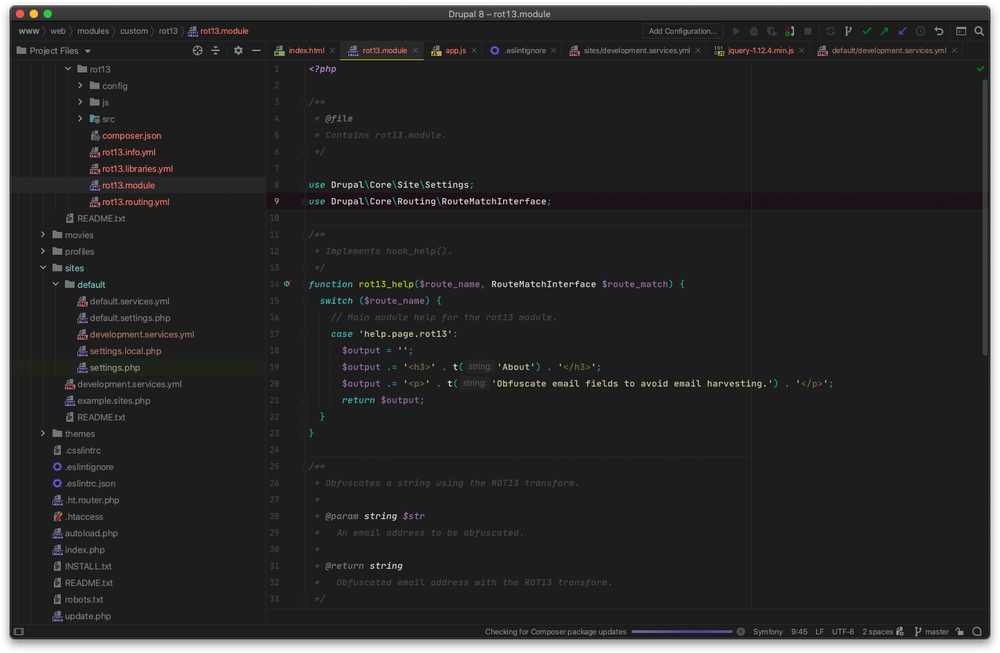
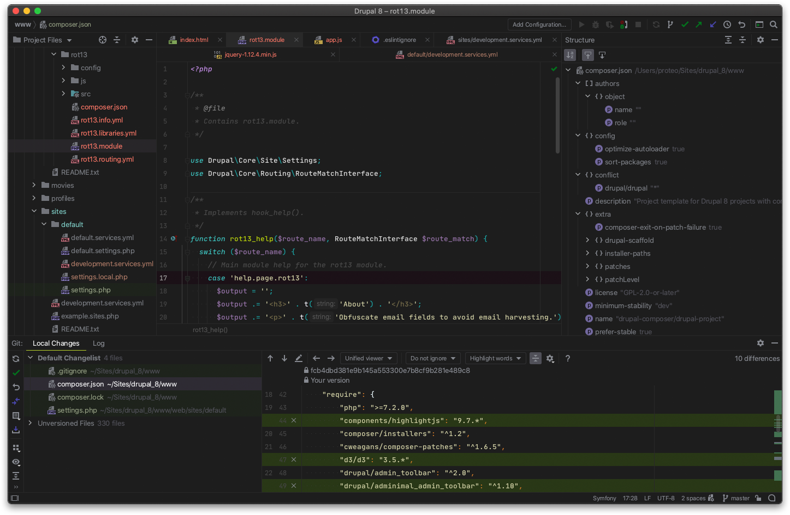
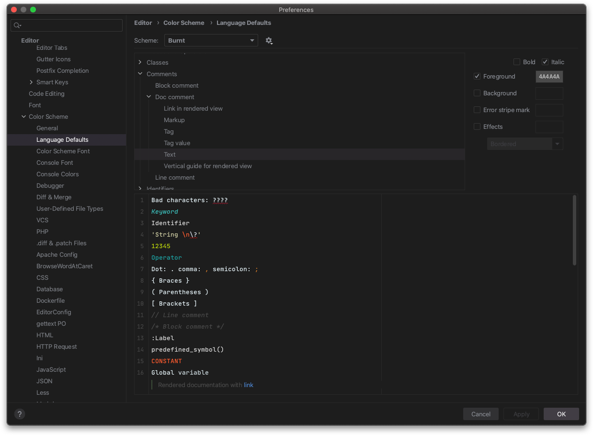

# Burnt Theme

### About

Burnt is a dark theme for JetBrains IDEs (2019.1+) with the right visual clues to assist you in your long coding journeys. The accompanying color scheme features a rich, vibrant palette, carefully tuned to help you stay focused and productive.

### Why the Burnt theme?

Because other dark themes are not dark or good enouhg for my taste. This is a really dark theme, crafted with great attention to the detail, and trying to cover the whole IDE to provide a comprehensive coding experience. It's main purpose is to let you focus on what matters: the code.

Hope you enjoy it as much as I do!

### Screenshots

### Contribute

Found a bug or have a suggestion? Let me know in the issue tracker:

https://github.com/proteo/burnt/issues